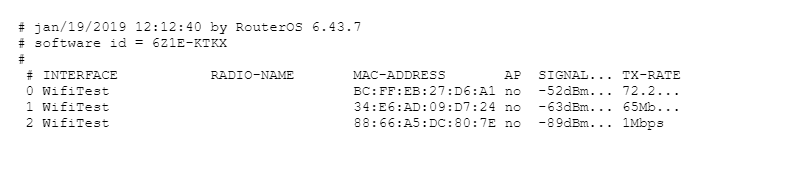

#  Monitoring Wifi Access Point
Monitorovanie pripojených používatelov a následné zaslanie informácií o nich na E-mail.

### Nastavenie Wifi Access Point
Ako prvé sa  musia nastaviť DNS a DHCP server, DHCP client, NAT a Address List.

#### Následne nastavenie samotnej Wifi
Nastavenie spočíva : mode = AP bridge, SSID = názov Wifi, nastavenie zabezpečenia v Security profiles.
### Nastavenie posielania E-mailu

### Script v Scheduler
Hlavný script, ktorý kopíruje registračnú tabuľku zo zariadenia a ukladá ju do vytvoreného súboru 'wifi.txt' a následne posiela na emailovú adresu.

### Spúštanie scriptu
Spúsťenie scriptu sa uskutoční po stlačený tlačitka 'Run Script'.

### Vzorová ukážka prijatého E-mailu
Na obrázku môžeme vidieť troch pripojených používatelov a údaje o nich.

