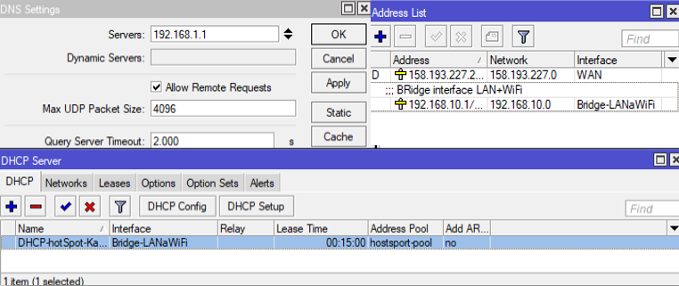
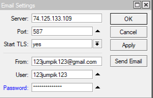
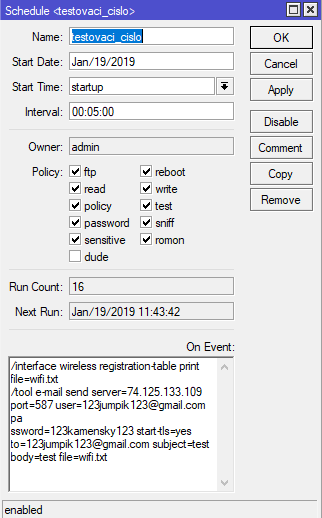
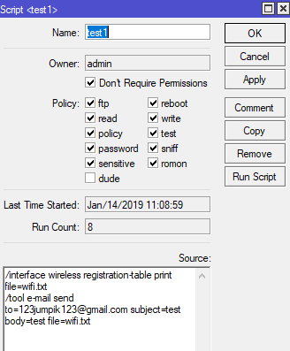

#  Monitoring Wifi Access Point
Monitorovanie pripojených užívatelov a o ních základné informácie

### Nastavenie Wifi Access Point
Ako prvé sa  musia nastaviť DNS,DHCP server, DHCP client, NAT a Address List

#### Následne nastavenie samotnej Wifi

### Nastavenie posielania E-mailu

### Script v Scheduler

### Spúštanie scriptu

### Vzorová ukážka prijatého E-mailu
Traja pripojení používatelia

